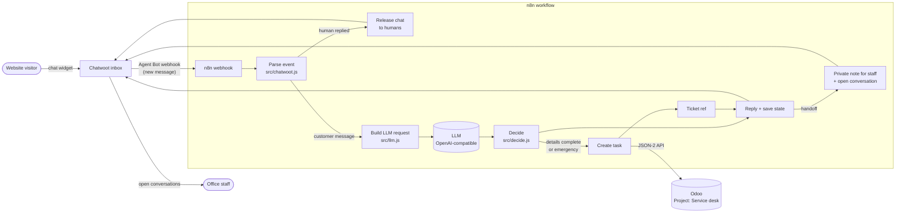

# AI chat to service ticket

[](https://github.com/birneyj1218/ai-chat-to-service-ticket/actions/workflows/ci.yml)
[](https://github.com/birneyj1218/ai-chat-to-service-ticket/actions/workflows/secret-scan.yml)

A website chat assistant for a trades business, shown here for the fictional **Stonebridge Plumbing**.

**In plain English:** a customer opens the chat bubble on your website at 9pm because their water heater is leaking. The assistant answers their questions (hours, service area, what you fix) from facts you wrote, never guesses prices, and asks for the job details one at a time: what's wrong, how urgent, name, phone, address. Then it opens a service ticket in your office system, gives the customer a reference number, and tells them what happens next. If the customer asks for a person, if something sounds dangerous (gas smell, water pouring in), or if the assistant isn't sure, it hands the chat to your staff with a summary, and it stays quiet from then on.

Stack: [Chatwoot](https://www.chatwoot.com/) (chat widget and inbox) + [n8n](https://n8n.io/) (workflow) + any OpenAI-compatible LLM (model configurable, can be local) + [Odoo](https://www.odoo.com/) Project (tickets).

## Architecture



One customer message = one run of the workflow. The conversation's progress (which details are collected, what was just asked, turn count, ticket ids) is stored on the Chatwoot conversation as a custom attribute, so n8n keeps no session state of its own.

The decision logic lives in plain JavaScript modules in [`src/`](src) with unit tests. `scripts/build-workflow.js` pastes those modules into the n8n Code nodes, and CI fails if [`n8n/workflow.json`](n8n/workflow.json) drifts from the tested source.

### What decides the reply

| Order | Rule | Who decides |
|---|---|---|
| 1 | Gas smell: "leave and call 911 from outside", urgent ticket, hand off | Fixed code, before the LLM result is used |
| 2 | Water pouring / burst / flooding / sewage: "turn off the main valve", urgent ticket, hand off | Fixed code |
| 3 | Customer asks for a person | Code (keywords) or LLM intent `human` |
| 4 | Turn limit reached (default 15 messages) | Code |
| 5 | Service request: ask for missing details one at a time, then open the ticket | LLM extracts details, code validates them (phone must have 10 to 15 digits, urgency must be emergency / soon / routine) |
| 6 | Question: post the LLM's answer only if confidence is at least `min_confidence` and it passes the guards (no prices, no licence or insurance claims) | LLM drafts, code guards |
| 7 | Unsure twice in a row (low confidence, LLM down, unclear message) | Code: hand off |

## How the handoff works

Chatwoot only sends a conversation to an Agent Bot while the conversation's status is **pending**.

1. When the bot hands off, it posts a **private note** for staff (what was collected, the ticket number, and why it handed off), then sets the conversation to **open**. It shows up in the team's inbox like any other chat.
2. From that moment the bot ignores the conversation: `Parse event` drops every event whose conversation is not pending.
3. If a staff member replies while the bot still owns the chat, the workflow sees an outgoing message from a human user and releases the chat (sets it to open) without saying anything.
4. To give a conversation back to the bot, set it to pending again in Chatwoot.

## Setup

You need Docker with the Compose plugin, about 4 GB of free RAM, and an API key for an OpenAI-compatible LLM (or a local server such as Ollama or vLLM).

1. **Configure.** `cp .env.example .env` and replace every `change-me` value (`openssl rand -hex 32` makes good secrets).
2. **Start the stack.** `docker compose up -d`. The first start takes a few minutes: Chatwoot runs its database migrations and Odoo creates the `servicedesk` database with the Project app.
3. **Odoo** (http://localhost:8069).
   1. Log in as `admin` / `admin` and change that password right away.
   2. Create a project named "Service desk". Its id is in the URL (`.../project/<id>/...`).
   3. Create an internal user for the bot (for example "chat-bot") with **Project: User** rights and nothing else. Log in as that user, then *Preferences > Account Security > New API Key*. Copy the key.
4. **Chatwoot** (http://localhost:3000).
   1. Finish the first-run screen to create the admin account.
   2. *Settings > Inboxes > Add Inbox > Website*. Optionally turn on the pre-chat form (name and phone) so the bot does not need to ask for them.
5. **n8n** (http://localhost:5678).
   1. Create the owner account, then *Workflows > Import from File* and pick `n8n/workflow.json`.
   2. In the **Chatwoot webhook** node, replace `CHANGE-ME-to-a-long-random-string` in the path with a long random string.
   3. In the **Config** node, set `odoo_project_id` (step 3.2), the LLM `llm_base_url` and `llm_model`, and your own `business_facts`.
6. **Credentials in n8n** (*Credentials > Add > Header Auth*). The workflow refers to them by these names:

   | Credential name | Header name | Header value |
   |---|---|---|
   | `LLM API key` | `Authorization` | `Bearer <your LLM API key>` |
   | `Odoo API key` | `Authorization` | `Bearer <the bot user's Odoo API key>` |
   | `Chatwoot bot token` | `api_access_token` | the Agent Bot access token from step 7 |

   Open each HTTP node once and check the credential is selected.
7. **Connect the Chatwoot bot.**
   1. Create an Agent Bot (*Settings > Bots*, or the super-admin console at `/super_admin`) with the webhook URL `http://n8n:5678/webhook/chatwoot-bot/<your random string>`. Containers reach each other by service name.
   2. Copy the bot's access token into the `Chatwoot bot token` credential.
   3. *Settings > Inboxes > (your website inbox) > Bot Configuration*: select the bot.
8. **Activate** the workflow in n8n, open your inbox's widget on a test page, and chat.

## Configuration

Infrastructure settings live in `.env`; behaviour lives in the n8n **Config** node (defaults in [`src/config.js`](src/config.js)); secrets live only in n8n credentials.

| Setting | Where | Default | Purpose |
|---|---|---|---|
| `POSTGRES_PASSWORD`, `N8N_DB_PASSWORD`, `ODOO_DB_PASSWORD`, `REDIS_PASSWORD` | `.env` | none (required) | Database and cache passwords |
| `CHATWOOT_SECRET_KEY_BASE`, `N8N_ENCRYPTION_KEY` | `.env` | none (required) | App secrets; n8n encrypts credentials with its key |
| `CHATWOOT_FRONTEND_URL`, `N8N_WEBHOOK_URL` | `.env` | `http://localhost:3000`, `http://localhost:5678/` | Public URLs |
| `CHATWOOT_VERSION`, `N8N_VERSION`, `ODOO_VERSION` | `.env` | `v4.18.0`, `2.42.6`, `19.0` | Image pins |
| `business_name`, `business_facts` | Config node | Stonebridge Plumbing demo facts | The only facts the LLM may answer from |
| `llm_base_url`, `llm_model` | Config node | `https://api.openai.com/v1`, `gpt-4o-mini` | Any OpenAI-compatible `/chat/completions` endpoint |
| `llm_json_mode` | Config node | `true` | Sends `response_format: json_object`; turn off if your server rejects it |
| `llm_max_tokens`, `llm_temperature` | Config node | `400`, `0.2` | Output cap and randomness |
| `min_confidence` | Config node | `0.6` | Below this, the bot does not answer on its own |
| `odoo_url`, `odoo_db`, `odoo_project_id` | Config node | `http://odoo:8069`, `servicedesk`, `1` | Where tickets go |
| `chatwoot_url` | Config node | `http://chatwoot:3000` | Chatwoot API base |
| `max_bot_turns` | Config node | `15` | Customer messages before the bot hands off |
| `max_message_chars` | Config node | `1000` | Longer messages are cut before the LLM call |
| `max_unsure` | Config node | `2` | "Not sure" turns in a row before handoff |

## Safety and design notes

- **Humans can always take over.** Asking for a person, a safety keyword, repeated uncertainty or the turn limit all hand off. Once a conversation is open, the bot never posts in it again, and a staff reply releases it immediately.
- **Safety rules are code, not prompts.** Gas and water emergencies are matched before the LLM's output is considered, use fixed wording, and still work if the LLM is unreachable.
- **The LLM drafts, code decides.** The model returns strict JSON (intent, extracted details, a draft answer, a confidence score). Malformed output is discarded. Answers are posted only above the confidence threshold, and a guard replaces any answer that quotes a price or claims a licence, insurance or certification.
- **No data leaves the stack except the LLM call.** Chatwoot, n8n, Odoo, Postgres and Redis all run in your Compose project. The only outbound request is to `llm_base_url`, and it carries the current message plus the details collected so far, not the chat history. Point `llm_base_url` at a local model server and nothing leaves at all.
- **Least privilege in Odoo.** The bot's Odoo user only needs to create tasks in one project. Its API key sits in an n8n credential, encrypted at rest.
- **Limits.** One LLM call per customer message, capped at `llm_max_tokens`; messages over `max_message_chars` are truncated; the bot hands off after `max_bot_turns`; HTTP calls time out after 20 s. For request-rate limiting, put the stack behind a reverse proxy (for example Traefik or nginx `limit_req`) in front of the n8n webhook and the Chatwoot widget.
- **Failures are honest.** If the LLM is down, rules still run and the bot hands off when unsure. If Odoo does not return a ticket id, the bot tells the customer it could not save the ticket and hands off, with a "ticket creation FAILED" note for staff.
- **Little stored in n8n.** Successful executions are not saved (`saveDataSuccessExecution: none`), and executions are pruned after 7 days.
- **Escaping.** All customer text is HTML-escaped before it goes into the Odoo task description.
- Ports bind to `127.0.0.1` only. Before going live, add TLS, change the default Odoo admin password, and keep the webhook path secret.

## Tests

```bash
npm test                 # or: node --test tests/*.test.js   (Node 20+, no dependencies)
npm run check:workflow   # n8n/workflow.json matches src/
npm run scan             # gitleaks + private-IP check before pushing
```

| File | Covers |
|---|---|
| `tests/decide.test.js` | Safety rules, handoff triggers, detail collection and validation, price and licence guards, turn and "unsure" limits, failed ticket creation, HTML escaping |
| `tests/llm.test.js` | Request shape (model, JSON mode, facts, truncation) and parsing of good, fenced and broken LLM replies |
| `tests/chatwoot.test.js` | Which webhook events are handled, ignored or released |
| `tests/odoo.test.js` | The Odoo client against an in-process mock of Odoo's JSON-2 and JSON-RPC APIs |
| `tests/workflow.test.js` | Runs `n8n/workflow.json` in a small simulator (`tests/n8n-sim.js`) with mocked LLM, Odoo and Chatwoot: ticket flow, LLM outage, Odoo failure, plain question, release, ignored chats; also checks credentials are referenced by name only |

CI runs the tests on Node 20 and 22, checks the workflow is in sync, validates `docker-compose.yml`, and runs gitleaks over the full history.

## Limitations

- The n8n simulator checks wiring, generated code and expressions; it is not n8n itself. After importing, run a test conversation end to end.
- The bot does not look up or create Odoo contacts. Customer details go into the task description, and the office links the contact.
- No calendar booking: the ticket says how urgent the job is, and the office confirms a time.
- English only, and detail extraction is only as good as the model you choose. Validation catches bad phone numbers and urgency values, not a wrong address.
- The LLM sees one message at a time plus the collected details, not the whole chat. That keeps data minimal, but it can miss context from earlier messages.
- Safety keywords are English regular expressions. They err on the side of handing off, and they will not catch every way of describing an emergency.
- Odoo 19's JSON-2 API is used by the workflow. On Odoo 18 or older, use the classic JSON-RPC path shown in `src/odoo.js` or n8n's Odoo node.
- If your Chatwoot version refuses webhook URLs on a private network, publish the n8n webhook through your reverse proxy and use its HTTPS URL.

## Project layout

```
src/            decision logic, LLM request/parse, Chatwoot event parsing, Odoo client, default config
n8n/            workflow.json (generated, importable)
scripts/        build-workflow.js, secret-scan.sh
tests/          node:test suites, mock Odoo, n8n simulator
docs/           sample conversation and ticket example
docker/         Postgres first-run script
```

## License

[MIT](LICENSE)

---

Built by Jim Birney · [evolvaiagents.com](https://evolvaiagents.com) · [Live chat demo](https://evolvaiagents.com/review/stonebridge-chat-demo.html) · [Video walkthrough](https://evolvaiagents.com/review/ai-chat-assistant-demo.mp4)
